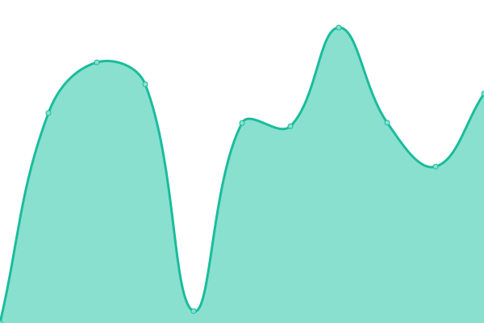

# [📈 Live Status](https://Altair47.github.io/3nt-upptime): <!--live status--> **🟧 Partial outage**

This repository contains the open-source uptime monitor and status page for [Nick Petropoulos](altair47.github.io), powered by [Upptime](https://github.com/upptime/upptime).

With [Upptime](https://upptime.js.org), you can get your own unlimited and free uptime monitor and status page, powered entirely by a GitHub repository. We use [Issues](https://github.com/Altair47/3nt-upptime/issues) as incident reports, [Actions](https://github.com/Altair47/3nt-upptime/actions) as uptime monitors, and [Pages](https://Altair47.github.io/3nt-upptime) for the status page.

<!--start: status pages-->
<!-- This summary is generated by Upptime (https://github.com/upptime/upptime) -->
<!-- Do not edit this manually, your changes will be overwritten -->
<!-- prettier-ignore -->
| URL | Status | History | Response Time | Uptime |
| --- | ------ | ------- | ------------- | ------ |
|  [3nitas](https://3nitas.com) | 🟩 Up | [3nitas.yml](https://github.com/Altair47/3nt-upptime/commits/HEAD/history/3nitas.yml) | 

 467ms
     
 | 

<a href="https://Altair47.github.io/3nt-upptime/history/3nitas">100.00%</a>
    

|  [Ritmeester](https://myritmeester.nl) | 🟩 Up | [ritmeester.yml](https://github.com/Altair47/3nt-upptime/commits/HEAD/history/ritmeester.yml) | 

 463ms
     
 | 

<a href="https://Altair47.github.io/3nt-upptime/history/ritmeester">100.00%</a>
    

|  [Afis Kinigoi](https://afis-kinigoi.gr) | 🟩 Up | [afis-kinigoi.yml](https://github.com/Altair47/3nt-upptime/commits/HEAD/history/afis-kinigoi.yml) | 

 3703ms
     
 | 

<a href="https://Altair47.github.io/3nt-upptime/history/afis-kinigoi">100.00%</a>
    

|  [Alfa Beer](https://alfabeer.gr) | 🟩 Up | [alfa-beer.yml](https://github.com/Altair47/3nt-upptime/commits/HEAD/history/alfa-beer.yml) | 

 7467ms
     
 | 

<a href="https://Altair47.github.io/3nt-upptime/history/alfa-beer">100.00%</a>
    

|  [Antenna Group](https://antenna-group.com) | 🟩 Up | [antenna-group.yml](https://github.com/Altair47/3nt-upptime/commits/HEAD/history/antenna-group.yml) | 

 900ms
     
 | 

<a href="https://Altair47.github.io/3nt-upptime/history/antenna-group">100.00%</a>
    

|  [Antonis Fousas](https://antonisfousas.gr) | 🟩 Up | [antonis-fousas.yml](https://github.com/Altair47/3nt-upptime/commits/HEAD/history/antonis-fousas.yml) | 

 4704ms
     
 | 

<a href="https://Altair47.github.io/3nt-upptime/history/antonis-fousas">100.00%</a>
    

|  [Arjuna Maritime](https://arjunamaritime.id) | 🟩 Up | [arjuna-maritime.yml](https://github.com/Altair47/3nt-upptime/commits/HEAD/history/arjuna-maritime.yml) | 

 4705ms
     
 | 

<a href="https://Altair47.github.io/3nt-upptime/history/arjuna-maritime">100.00%</a>
    

|  [Blinqme](https://blinqme.com) | 🟩 Up | [blinqme.yml](https://github.com/Altair47/3nt-upptime/commits/HEAD/history/blinqme.yml) | 

 505ms
     
 | 

<a href="https://Altair47.github.io/3nt-upptime/history/blinqme">100.00%</a>
    

|  [Breast Imaging](https://breastimaging.gr) | 🟩 Up | [breast-imaging.yml](https://github.com/Altair47/3nt-upptime/commits/HEAD/history/breast-imaging.yml) | 

 6005ms
     
 | 

<a href="https://Altair47.github.io/3nt-upptime/history/breast-imaging">100.00%</a>
    

|  [Epsilon Hellas](https://epsilonhellas.com) | 🟩 Up | [epsilon-hellas.yml](https://github.com/Altair47/3nt-upptime/commits/HEAD/history/epsilon-hellas.yml) | 

 2014ms
     
 | 

<a href="https://Altair47.github.io/3nt-upptime/history/epsilon-hellas">100.00%</a>
    

|  [Epsilon Hellas Ukraine](https://epsilonhellas.com.ua) | 🟩 Up | [epsilon-hellas-ukraine.yml](https://github.com/Altair47/3nt-upptime/commits/HEAD/history/epsilon-hellas-ukraine.yml) | 

 2479ms
     
 | 

<a href="https://Altair47.github.io/3nt-upptime/history/epsilon-hellas-ukraine">100.00%</a>
    

|  [Epsilon Odessa](https://epsilonodessa.com.ua) | 🟥 Down | [epsilon-odessa.yml](https://github.com/Altair47/3nt-upptime/commits/HEAD/history/epsilon-odessa.yml) | 

 0ms
     
 | 

<a href="https://Altair47.github.io/3nt-upptime/history/epsilon-odessa">0.00%</a>
    

|  [Fischer Beer](https://fischerbeer.gr) | 🟩 Up | [fischer-beer.yml](https://github.com/Altair47/3nt-upptime/commits/HEAD/history/fischer-beer.yml) | 

 3483ms
     
 | 

<a href="https://Altair47.github.io/3nt-upptime/history/fischer-beer">100.00%</a>
    

|  [Gerofinikas Boutique Hotel](https://gerofinikasboutiquehotel.com) | 🟩 Up | [gerofinikas-boutique-hotel.yml](https://github.com/Altair47/3nt-upptime/commits/HEAD/history/gerofinikas-boutique-hotel.yml) | 

 4174ms
     
 | 

<a href="https://Altair47.github.io/3nt-upptime/history/gerofinikas-boutique-hotel">100.00%</a>
    

|  [Hazmat](https://hazmat.gr) | 🟩 Up | [hazmat.yml](https://github.com/Altair47/3nt-upptime/commits/HEAD/history/hazmat.yml) | 

 4939ms
     
 | 

<a href="https://Altair47.github.io/3nt-upptime/history/hazmat">100.00%</a>
    

|  [IGI Poseidon](https://igi-poseidon.com) | 🟩 Up | [igi-poseidon.yml](https://github.com/Altair47/3nt-upptime/commits/HEAD/history/igi-poseidon.yml) | 

 120ms
     
 | 

<a href="https://Altair47.github.io/3nt-upptime/history/igi-poseidon">100.00%</a>
    

|  [Kore](https://kore.gr) | 🟥 Down | [kore.yml](https://github.com/Altair47/3nt-upptime/commits/HEAD/history/kore.yml) | 

 135ms
     
 | 

<a href="https://Altair47.github.io/3nt-upptime/history/kore">100.00%</a>
    

|  [Let's Place](https://letsplace.gr) | 🟩 Up | [let-s-place.yml](https://github.com/Altair47/3nt-upptime/commits/HEAD/history/let-s-place.yml) | 

 683ms
     
 | 

<a href="https://Altair47.github.io/3nt-upptime/history/let-s-place">100.00%</a>
    

|  [Mamos](https://mamos.gr) | 🟥 Down | [mamos.yml](https://github.com/Altair47/3nt-upptime/commits/HEAD/history/mamos.yml) | 

 168ms
     
 | 

<a href="https://Altair47.github.io/3nt-upptime/history/mamos">0.00%</a>
    

|  [Myritmeester](https://myritmeester.nl) | 🟩 Up | [myritmeester.yml](https://github.com/Altair47/3nt-upptime/commits/HEAD/history/myritmeester.yml) | 

 369ms
     
 | 

<a href="https://Altair47.github.io/3nt-upptime/history/myritmeester">100.00%</a>
    

|  [oseven](https://oseven.io) | 🟩 Up | [oseven.yml](https://github.com/Altair47/3nt-upptime/commits/HEAD/history/oseven.yml) | 

 1164ms
     
 | 

<a href="https://Altair47.github.io/3nt-upptime/history/oseven">100.00%</a>
    

|  [OTE Academy](https://oteacademy.gr) | 🟥 Down | [ote-academy.yml](https://github.com/Altair47/3nt-upptime/commits/HEAD/history/ote-academy.yml) | 

 2978ms
     
 | 

<a href="https://Altair47.github.io/3nt-upptime/history/ote-academy">0.00%</a>
    

|  [Papadopoulou](https://papadopoulou.gr) | 🟥 Down | [papadopoulou.yml](https://github.com/Altair47/3nt-upptime/commits/HEAD/history/papadopoulou.yml) | 

 199ms
     
 | 

<a href="https://Altair47.github.io/3nt-upptime/history/papadopoulou">0.00%</a>
    

|  [Pastel Yachting](https://pastelyachting.gr) | 🟩 Up | [pastel-yachting.yml](https://github.com/Altair47/3nt-upptime/commits/HEAD/history/pastel-yachting.yml) | 

 612ms
     
 | 

<a href="https://Altair47.github.io/3nt-upptime/history/pastel-yachting">100.00%</a>
    

|  [Samaras Mining](https://samarasmining.com) | 🟩 Up | [samaras-mining.yml](https://github.com/Altair47/3nt-upptime/commits/HEAD/history/samaras-mining.yml) | 

 658ms
     
 | 

<a href="https://Altair47.github.io/3nt-upptime/history/samaras-mining">100.00%</a>
    

|  [Sanola](https://sanola.gr) | 🟩 Up | [sanola.yml](https://github.com/Altair47/3nt-upptime/commits/HEAD/history/sanola.yml) | 

 638ms
     
 | 

<a href="https://Altair47.github.io/3nt-upptime/history/sanola">100.00%</a>
    

|  [Southbridge Partners](https://southbridge-partners.com) | 🟩 Up | [southbridge-partners.yml](https://github.com/Altair47/3nt-upptime/commits/HEAD/history/southbridge-partners.yml) | 

 614ms
     
 | 

<a href="https://Altair47.github.io/3nt-upptime/history/southbridge-partners">100.00%</a>
    

|  [The Circle Group App](https://thecirclegroupapp.com) | 🟩 Up | [the-circle-group-app.yml](https://github.com/Altair47/3nt-upptime/commits/HEAD/history/the-circle-group-app.yml) | 

 383ms
     
 | 

<a href="https://Altair47.github.io/3nt-upptime/history/the-circle-group-app">100.00%</a>
    

|  [Three Cents](https://threecents.com) | 🟩 Up | [three-cents.yml](https://github.com/Altair47/3nt-upptime/commits/HEAD/history/three-cents.yml) | 

 4695ms
     
 | 

<a href="https://Altair47.github.io/3nt-upptime/history/three-cents">100.00%</a>
    

|  [3Nitas](https://threenitas.com) | 🟩 Up | [3-nitas.yml](https://github.com/Altair47/3nt-upptime/commits/HEAD/history/3-nitas.yml) | 

 148ms
     
 | 

<a href="https://Altair47.github.io/3nt-upptime/history/3-nitas">100.00%</a>
    

|  [To Prasinóspiti](https://toprasinospiti.gr) | 🟩 Up | [to-prasinospiti.yml](https://github.com/Altair47/3nt-upptime/commits/HEAD/history/to-prasinospiti.yml) | 

 2562ms
     
 | 

<a href="https://Altair47.github.io/3nt-upptime/history/to-prasinospiti">100.00%</a>
    

|  [VMG](https://vmg.gr) | 🟩 Up | [vmg.yml](https://github.com/Altair47/3nt-upptime/commits/HEAD/history/vmg.yml) | 

 628ms
     
 | 

<a href="https://Altair47.github.io/3nt-upptime/history/vmg">100.00%</a>
    

|  [Xriselia](https://xriselia.gr) | 🟩 Up | [xriselia.yml](https://github.com/Altair47/3nt-upptime/commits/HEAD/history/xriselia.yml) | 

 4401ms
     
 | 

<a href="https://Altair47.github.io/3nt-upptime/history/xriselia">100.00%</a>
    

<!--end: status pages-->

[**Visit our status website →**](https://Altair47.github.io/3nt-upptime)

## 📄 License

- Powered by: [Upptime](https://github.com/upptime/upptime)
- Code: [MIT](./LICENSE) © [Nick Petropoulos](altair47.github.io)
- Data in the `./history` directory: [Open Database License](https://opendatacommons.org/licenses/odbl/1-0/)
