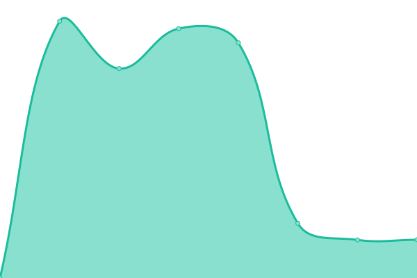

# [📈 Live Status](https://Altair47.github.io/3nt-upptime): <!--live status--> **🟩 All systems operational**

This repository contains the open-source uptime monitor and status page for [Nick Petropoulos](altair47.github.io), powered by [Upptime](https://github.com/upptime/upptime).

With [Upptime](https://upptime.js.org), you can get your own unlimited and free uptime monitor and status page, powered entirely by a GitHub repository. We use [Issues](https://github.com/Altair47/3nt-upptime/issues) as incident reports, [Actions](https://github.com/Altair47/3nt-upptime/actions) as uptime monitors, and [Pages](https://Altair47.github.io/3nt-upptime) for the status page.

<!--start: status pages-->
<!-- This summary is generated by Upptime (https://github.com/upptime/upptime) -->
<!-- Do not edit this manually, your changes will be overwritten -->
<!-- prettier-ignore -->
| URL | Status | History | Response Time | Uptime |
| --- | ------ | ------- | ------------- | ------ |
|  [3nitas](https://3nitas.com) | 🟩 Up | [3nitas.yml](https://github.com/Altair47/3nt-upptime/commits/HEAD/history/3nitas.yml) | 

 459ms
     
 | 

<a href="https://Altair47.github.io/3nt-upptime/history/3nitas">99.77%</a>
    

|  [Afis](https://afis.gr) | 🟩 Up | [afis.yml](https://github.com/Altair47/3nt-upptime/commits/HEAD/history/afis.yml) | 

 4771ms
     
 | 

<a href="https://Altair47.github.io/3nt-upptime/history/afis">99.78%</a>
    

|  [Afis Kinigoi](https://afis-kinigoi.gr) | 🟩 Up | [afis-kinigoi.yml](https://github.com/Altair47/3nt-upptime/commits/HEAD/history/afis-kinigoi.yml) | 

 7491ms
     
 | 

<a href="https://Altair47.github.io/3nt-upptime/history/afis-kinigoi">99.80%</a>
    

|  [Alfa Beer](https://alfabeer.gr) | 🟩 Up | [alfa-beer.yml](https://github.com/Altair47/3nt-upptime/commits/HEAD/history/alfa-beer.yml) | 

 4180ms
     
 | 

<a href="https://Altair47.github.io/3nt-upptime/history/alfa-beer">100.00%</a>
    

|  [Antenna Group](https://antenna-group.com) | 🟩 Up | [antenna-group.yml](https://github.com/Altair47/3nt-upptime/commits/HEAD/history/antenna-group.yml) | 

 876ms
     
 | 

<a href="https://Altair47.github.io/3nt-upptime/history/antenna-group">81.64%</a>
    

|  [Antonis Fousas](https://antonisfousas.gr) | 🟩 Up | [antonis-fousas.yml](https://github.com/Altair47/3nt-upptime/commits/HEAD/history/antonis-fousas.yml) | 

 4901ms
     
 | 

<a href="https://Altair47.github.io/3nt-upptime/history/antonis-fousas">99.64%</a>
    

|  [Arjuna Maritime](https://arjunamaritime.id) | 🟩 Up | [arjuna-maritime.yml](https://github.com/Altair47/3nt-upptime/commits/HEAD/history/arjuna-maritime.yml) | 

 4320ms
     
 | 

<a href="https://Altair47.github.io/3nt-upptime/history/arjuna-maritime">99.67%</a>
    

|  [Blinqme](https://blinqme.com) | 🟩 Up | [blinqme.yml](https://github.com/Altair47/3nt-upptime/commits/HEAD/history/blinqme.yml) | 

 4532ms
     
 | 

<a href="https://Altair47.github.io/3nt-upptime/history/blinqme">99.83%</a>
    

|  [Breast Imaging](https://breastimaging.gr) | 🟩 Up | [breast-imaging.yml](https://github.com/Altair47/3nt-upptime/commits/HEAD/history/breast-imaging.yml) | 

 3711ms
     
 | 

<a href="https://Altair47.github.io/3nt-upptime/history/breast-imaging">99.83%</a>
    

|  [Campari Passion](https://camparipassion.gr) | 🟩 Up | [campari-passion.yml](https://github.com/Altair47/3nt-upptime/commits/HEAD/history/campari-passion.yml) | 

 2667ms
     
 | 

<a href="https://Altair47.github.io/3nt-upptime/history/campari-passion">99.83%</a>
    

|  [Elekap](https://elekap.org) | 🟩 Up | [elekap.yml](https://github.com/Altair47/3nt-upptime/commits/HEAD/history/elekap.yml) | 

 3986ms
     
 | 

<a href="https://Altair47.github.io/3nt-upptime/history/elekap">100.00%</a>
    

|  [EOS Systems](https://eos-systems.gr) | 🟩 Up | [eos-systems.yml](https://github.com/Altair47/3nt-upptime/commits/HEAD/history/eos-systems.yml) | 

 630ms
     
 | 

<a href="https://Altair47.github.io/3nt-upptime/history/eos-systems">100.00%</a>
    

|  [Epsilon Hellas](https://epsilonhellas.com) | 🟩 Up | [epsilon-hellas.yml](https://github.com/Altair47/3nt-upptime/commits/HEAD/history/epsilon-hellas.yml) | 

 3363ms
     
 | 

<a href="https://Altair47.github.io/3nt-upptime/history/epsilon-hellas">100.00%</a>
    

|  [Epsilon Hellas Ukraine](https://epsilonhellas.com.ua) | 🟩 Up | [epsilon-hellas-ukraine.yml](https://github.com/Altair47/3nt-upptime/commits/HEAD/history/epsilon-hellas-ukraine.yml) | 

 2243ms
     
 | 

<a href="https://Altair47.github.io/3nt-upptime/history/epsilon-hellas-ukraine">100.00%</a>
    

|  [Epsilon Odessa](https://epsilonodessa.com.ua) | 🟩 Up | [epsilon-odessa.yml](https://github.com/Altair47/3nt-upptime/commits/HEAD/history/epsilon-odessa.yml) | 

 690ms
     
 | 

<a href="https://Altair47.github.io/3nt-upptime/history/epsilon-odessa">100.00%</a>
    

|  [Expedite](https://expedite.gr) | 🟩 Up | [expedite.yml](https://github.com/Altair47/3nt-upptime/commits/HEAD/history/expedite.yml) | 

 2678ms
     
 | 

<a href="https://Altair47.github.io/3nt-upptime/history/expedite">100.00%</a>
    

|  [Fischer Beer](https://fischerbeer.gr) | 🟩 Up | [fischer-beer.yml](https://github.com/Altair47/3nt-upptime/commits/HEAD/history/fischer-beer.yml) | 

 5058ms
     
 | 

<a href="https://Altair47.github.io/3nt-upptime/history/fischer-beer">100.00%</a>
    

|  [Gerofinikas Boutique Hotel](https://gerofinikasboutiquehotel.com) | 🟩 Up | [gerofinikas-boutique-hotel.yml](https://github.com/Altair47/3nt-upptime/commits/HEAD/history/gerofinikas-boutique-hotel.yml) | 

 4879ms
     
 | 

<a href="https://Altair47.github.io/3nt-upptime/history/gerofinikas-boutique-hotel">100.00%</a>
    

|  [Hazmat](https://hazmat.gr) | 🟩 Up | [hazmat.yml](https://github.com/Altair47/3nt-upptime/commits/HEAD/history/hazmat.yml) | 

 7008ms
     
 | 

<a href="https://Altair47.github.io/3nt-upptime/history/hazmat">100.00%</a>
    

|  [IGI Poseidon](https://igi-poseidon.com) | 🟩 Up | [igi-poseidon.yml](https://github.com/Altair47/3nt-upptime/commits/HEAD/history/igi-poseidon.yml) | 

 681ms
     
 | 

<a href="https://Altair47.github.io/3nt-upptime/history/igi-poseidon">100.00%</a>
    

|  [Kore](https://kore.gr) | 🟩 Up | [kore.yml](https://github.com/Altair47/3nt-upptime/commits/HEAD/history/kore.yml) | 

 10481ms
     
 | 

<a href="https://Altair47.github.io/3nt-upptime/history/kore">100.00%</a>
    

|  [Let's Place](https://letsplace.gr) | 🟩 Up | [let-s-place.yml](https://github.com/Altair47/3nt-upptime/commits/HEAD/history/let-s-place.yml) | 

 3081ms
     
 | 

<a href="https://Altair47.github.io/3nt-upptime/history/let-s-place">99.83%</a>
    

|  [Mail Delivery](https://maildelivery.gr) | 🟩 Up | [mail-delivery.yml](https://github.com/Altair47/3nt-upptime/commits/HEAD/history/mail-delivery.yml) | 

 641ms
     
 | 

<a href="https://Altair47.github.io/3nt-upptime/history/mail-delivery">100.00%</a>
    

|  [Mamos](https://mamos.gr) | 🟩 Up | [mamos.yml](https://github.com/Altair47/3nt-upptime/commits/HEAD/history/mamos.yml) | 

 9831ms
     
 | 

<a href="https://Altair47.github.io/3nt-upptime/history/mamos">100.00%</a>
    

|  [Milies Ilia's](https://miliesilias.gr) | 🟩 Up | [milies-ilia-s.yml](https://github.com/Altair47/3nt-upptime/commits/HEAD/history/milies-ilia-s.yml) | 

 840ms
     
 | 

<a href="https://Altair47.github.io/3nt-upptime/history/milies-ilia-s">100.00%</a>
    

|  [MPD](https://mpd.gr) | 🟩 Up | [mpd.yml](https://github.com/Altair47/3nt-upptime/commits/HEAD/history/mpd.yml) | 

 3787ms
     
 | 

<a href="https://Altair47.github.io/3nt-upptime/history/mpd">100.00%</a>
    

|  [Myritmeester](https://myritmeester.nl) | 🟩 Up | [myritmeester.yml](https://github.com/Altair47/3nt-upptime/commits/HEAD/history/myritmeester.yml) | 

 696ms
     
 | 

<a href="https://Altair47.github.io/3nt-upptime/history/myritmeester">100.00%</a>
    

|  [oseven](https://oseven.io) | 🟩 Up | [oseven.yml](https://github.com/Altair47/3nt-upptime/commits/HEAD/history/oseven.yml) | 

 1077ms
     
 | 

<a href="https://Altair47.github.io/3nt-upptime/history/oseven">100.00%</a>
    

|  [OTE Academy](https://oteacademy.gr) | 🟩 Up | [ote-academy.yml](https://github.com/Altair47/3nt-upptime/commits/HEAD/history/ote-academy.yml) | 

 4512ms
     
 | 

<a href="https://Altair47.github.io/3nt-upptime/history/ote-academy">100.00%</a>
    

|  [Papadopoulou](https://papadopoulou.gr) | 🟩 Up | [papadopoulou.yml](https://github.com/Altair47/3nt-upptime/commits/HEAD/history/papadopoulou.yml) | 

 783ms
     
 | 

<a href="https://Altair47.github.io/3nt-upptime/history/papadopoulou">100.00%</a>
    

|  [Paradeigmatos Harin](https://paradeigmatos-harin.gr) | 🟩 Up | [paradeigmatos-harin.yml](https://github.com/Altair47/3nt-upptime/commits/HEAD/history/paradeigmatos-harin.yml) | 

 2013ms
     
 | 

<a href="https://Altair47.github.io/3nt-upptime/history/paradeigmatos-harin">100.00%</a>
    

|  [Pastel Yachting](https://pastelyachting.gr) | 🟩 Up | [pastel-yachting.yml](https://github.com/Altair47/3nt-upptime/commits/HEAD/history/pastel-yachting.yml) | 

 2922ms
     
 | 

<a href="https://Altair47.github.io/3nt-upptime/history/pastel-yachting">100.00%</a>
    

|  [Primo Gusto](https://primogusto.gr) | 🟩 Up | [primo-gusto.yml](https://github.com/Altair47/3nt-upptime/commits/HEAD/history/primo-gusto.yml) | 

 121ms
     
 | 

<a href="https://Altair47.github.io/3nt-upptime/history/primo-gusto">100.00%</a>
    

|  [Priority Cyprus](https://www.priority.com.cy) | 🟩 Up | [priority-cyprus.yml](https://github.com/Altair47/3nt-upptime/commits/HEAD/history/priority-cyprus.yml) | 

 647ms
     
 | 

<a href="https://Altair47.github.io/3nt-upptime/history/priority-cyprus">100.00%</a>
    

|  [Priority Greece](https://www.priority.com.gr) | 🟩 Up | [priority-greece.yml](https://github.com/Altair47/3nt-upptime/commits/HEAD/history/priority-greece.yml) | 

 707ms
     
 | 

<a href="https://Altair47.github.io/3nt-upptime/history/priority-greece">100.00%</a>
    

|  [Reach-Cheree](https://reach-cheree.gr) | 🟩 Up | [reach-cheree.yml](https://github.com/Altair47/3nt-upptime/commits/HEAD/history/reach-cheree.yml) | 

 2004ms
     
 | 

<a href="https://Altair47.github.io/3nt-upptime/history/reach-cheree">100.00%</a>
    

|  [Samaras Mining](https://samarasmining.com) | 🟩 Up | [samaras-mining.yml](https://github.com/Altair47/3nt-upptime/commits/HEAD/history/samaras-mining.yml) | 

 710ms
     
 | 

<a href="https://Altair47.github.io/3nt-upptime/history/samaras-mining">100.00%</a>
    

|  [Sanola](https://sanola.gr) | 🟩 Up | [sanola.yml](https://github.com/Altair47/3nt-upptime/commits/HEAD/history/sanola.yml) | 

 675ms
     
 | 

<a href="https://Altair47.github.io/3nt-upptime/history/sanola">100.00%</a>
    

|  [Southbridge Partners](https://southbridge-partners.com) | 🟩 Up | [southbridge-partners.yml](https://github.com/Altair47/3nt-upptime/commits/HEAD/history/southbridge-partners.yml) | 

 3128ms
     
 | 

<a href="https://Altair47.github.io/3nt-upptime/history/southbridge-partners">100.00%</a>
    

|  [The Circle Group App](https://thecirclegroupapp.com) | 🟩 Up | [the-circle-group-app.yml](https://github.com/Altair47/3nt-upptime/commits/HEAD/history/the-circle-group-app.yml) | 

 421ms
     
 | 

<a href="https://Altair47.github.io/3nt-upptime/history/the-circle-group-app">100.00%</a>
    

|  [The Jungle Ad](https://thejunglead.com) | 🟩 Up | [the-jungle-ad.yml](https://github.com/Altair47/3nt-upptime/commits/HEAD/history/the-jungle-ad.yml) | 

 515ms
     
 | 

<a href="https://Altair47.github.io/3nt-upptime/history/the-jungle-ad">100.00%</a>
    

|  [Three Cents](https://threecents.com) | 🟩 Up | [three-cents.yml](https://github.com/Altair47/3nt-upptime/commits/HEAD/history/three-cents.yml) | 

 4047ms
     
 | 

<a href="https://Altair47.github.io/3nt-upptime/history/three-cents">100.00%</a>
    

|  [3Nitas](https://threenitas.com) | 🟩 Up | [3-nitas.yml](https://github.com/Altair47/3nt-upptime/commits/HEAD/history/3-nitas.yml) | 

 111ms
     
 | 

<a href="https://Altair47.github.io/3nt-upptime/history/3-nitas">100.00%</a>
    

|  [To Prasinóspiti](https://toprasinospiti.gr) | 🟩 Up | [to-prasinospiti.yml](https://github.com/Altair47/3nt-upptime/commits/HEAD/history/to-prasinospiti.yml) | 

 2558ms
     
 | 

<a href="https://Altair47.github.io/3nt-upptime/history/to-prasinospiti">100.00%</a>
    

|  [Tothama](https://tothama.gr) | 🟩 Up | [tothama.yml](https://github.com/Altair47/3nt-upptime/commits/HEAD/history/tothama.yml) | 

 927ms
     
 | 

<a href="https://Altair47.github.io/3nt-upptime/history/tothama">100.00%</a>
    

|  [Veritas MTC](https://veritasmtc.com) | 🟩 Up | [veritas-mtc.yml](https://github.com/Altair47/3nt-upptime/commits/HEAD/history/veritas-mtc.yml) | 

 5400ms
     
 | 

<a href="https://Altair47.github.io/3nt-upptime/history/veritas-mtc">99.08%</a>
    

|  [VMG](https://vmg.gr) | 🟩 Up | [vmg.yml](https://github.com/Altair47/3nt-upptime/commits/HEAD/history/vmg.yml) | 

 3440ms
     
 | 

<a href="https://Altair47.github.io/3nt-upptime/history/vmg">100.00%</a>
    

|  [White Coast](https://whitecoast.gr) | 🟩 Up | [white-coast.yml](https://github.com/Altair47/3nt-upptime/commits/HEAD/history/white-coast.yml) | 

 1539ms
     
 | 

<a href="https://Altair47.github.io/3nt-upptime/history/white-coast">100.00%</a>
    

|  [Alfa Beer](https://www.alfabeer.gr) | 🟩 Up | [alfa-beer.yml](https://github.com/Altair47/3nt-upptime/commits/HEAD/history/alfa-beer.yml) | 

 4180ms
     
 | 

<a href="https://Altair47.github.io/3nt-upptime/history/alfa-beer">100.00%</a>
    

|  [Priority](https://www.priority.com.gr) | 🟩 Up | [priority.yml](https://github.com/Altair47/3nt-upptime/commits/HEAD/history/priority.yml) | 

 660ms
     
 | 

<a href="https://Altair47.github.io/3nt-upptime/history/priority">100.00%</a>
    

|  [Xriselia](https://xriselia.gr) | 🟩 Up | [xriselia.yml](https://github.com/Altair47/3nt-upptime/commits/HEAD/history/xriselia.yml) | 

 6641ms
     
 | 

<a href="https://Altair47.github.io/3nt-upptime/history/xriselia">100.00%</a>
    

|  [Zerris](https://zerris.gr) | 🟩 Up | [zerris.yml](https://github.com/Altair47/3nt-upptime/commits/HEAD/history/zerris.yml) | 

 3923ms
     
 | 

<a href="https://Altair47.github.io/3nt-upptime/history/zerris">100.00%</a>
    

<!--end: status pages-->

[**Visit our status website →**](https://Altair47.github.io/3nt-upptime)

## 📄 License

- Powered by: [Upptime](https://github.com/upptime/upptime)
- Code: [MIT](./LICENSE) © [Nick Petropoulos](altair47.github.io)
- Data in the `./history` directory: [Open Database License](https://opendatacommons.org/licenses/odbl/1-0/)
