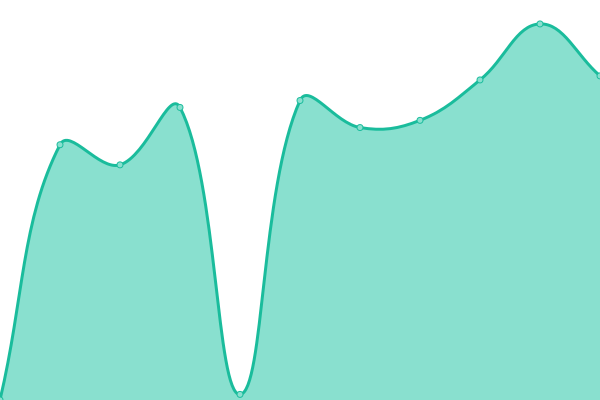
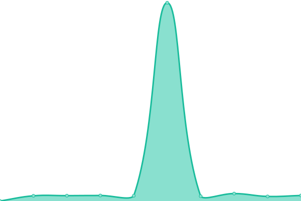

# [📈 Live Status](https://Altair47.github.io/3nt-upptime): <!--live status--> **🟧 Partial outage**

This repository contains the open-source uptime monitor and status page for [Nick Petropoulos](altair47.github.io), powered by [Upptime](https://github.com/upptime/upptime).

With [Upptime](https://upptime.js.org), you can get your own unlimited and free uptime monitor and status page, powered entirely by a GitHub repository. We use [Issues](https://github.com/Altair47/3nt-upptime/issues) as incident reports, [Actions](https://github.com/Altair47/3nt-upptime/actions) as uptime monitors, and [Pages](https://Altair47.github.io/3nt-upptime) for the status page.

<!--start: status pages-->
<!-- This summary is generated by Upptime (https://github.com/upptime/upptime) -->
<!-- Do not edit this manually, your changes will be overwritten -->
<!-- prettier-ignore -->
| URL | Status | History | Response Time | Uptime |
| --- | ------ | ------- | ------------- | ------ |
|  [3EMixItUp](https://3emixitup.gr) | 🟥 Down | [3-e-mix-it-up.yml](https://github.com/Altair47/3nt-upptime/commits/HEAD/history/3-e-mix-it-up.yml) | 

 0ms
     
 | 

<a href="https://Altair47.github.io/3nt-upptime/history/3-e-mix-it-up">0.73%</a>
    

|  [3nitas](https://3nitas.com) | 🟩 Up | [3nitas.yml](https://github.com/Altair47/3nt-upptime/commits/HEAD/history/3nitas.yml) | 

 427ms
     
 | 

<a href="https://Altair47.github.io/3nt-upptime/history/3nitas">100.00%</a>
    

|  [3ntxp](https://3ntxp.com) | 🟩 Up | [3ntxp.yml](https://github.com/Altair47/3nt-upptime/commits/HEAD/history/3ntxp.yml) | 

 536ms
     
 | 

<a href="https://Altair47.github.io/3nt-upptime/history/3ntxp">100.00%</a>
    

|  [Afis](https://afis.gr) | 🟩 Up | [afis.yml](https://github.com/Altair47/3nt-upptime/commits/HEAD/history/afis.yml) | 

 2228ms
     
 | 

<a href="https://Altair47.github.io/3nt-upptime/history/afis">100.00%</a>
    

|  [Afis Kinigoi](https://afis-kinigoi.gr) | 🟩 Up | [afis-kinigoi.yml](https://github.com/Altair47/3nt-upptime/commits/HEAD/history/afis-kinigoi.yml) | 

 5125ms
     
 | 

<a href="https://Altair47.github.io/3nt-upptime/history/afis-kinigoi">100.00%</a>
    

|  [Alfa Beer](https://alfabeer.gr) | 🟩 Up | [alfa-beer.yml](https://github.com/Altair47/3nt-upptime/commits/HEAD/history/alfa-beer.yml) | 

 3944ms
     
 | 

<a href="https://Altair47.github.io/3nt-upptime/history/alfa-beer">100.00%</a>
    

|  [Antenna Group](https://antenna-group.com) | 🟩 Up | [antenna-group.yml](https://github.com/Altair47/3nt-upptime/commits/HEAD/history/antenna-group.yml) | 

 837ms
     
 | 

<a href="https://Altair47.github.io/3nt-upptime/history/antenna-group">100.00%</a>
    

|  [Antonis Fousas](https://antonisfousas.gr) | 🟩 Up | [antonis-fousas.yml](https://github.com/Altair47/3nt-upptime/commits/HEAD/history/antonis-fousas.yml) | 

 1525ms
     
 | 

<a href="https://Altair47.github.io/3nt-upptime/history/antonis-fousas">100.00%</a>
    

|  [Aperol Orange Parties](https://aperolorangeparties.gr) | 🟥 Down | [aperol-orange-parties.yml](https://github.com/Altair47/3nt-upptime/commits/HEAD/history/aperol-orange-parties.yml) | 

 0ms
     
 | 

<a href="https://Altair47.github.io/3nt-upptime/history/aperol-orange-parties">0.53%</a>
    

|  [Aperol Spritz Joy](https://aperolspritzjoy.gr) | 🟥 Down | [aperol-spritz-joy.yml](https://github.com/Altair47/3nt-upptime/commits/HEAD/history/aperol-spritz-joy.yml) | 

 753ms
     
 | 

<a href="https://Altair47.github.io/3nt-upptime/history/aperol-spritz-joy">0.40%</a>
    

|  [Aperol Spritz The Joy in Statest](https://aperolspritzthejoyinstatest.gr) | 🟥 Down | [aperol-spritz-the-joy-in-statest.yml](https://github.com/Altair47/3nt-upptime/commits/HEAD/history/aperol-spritz-the-joy-in-statest.yml) | 

 0ms
     
 | 

<a href="https://Altair47.github.io/3nt-upptime/history/aperol-spritz-the-joy-in-statest">0.51%</a>
    

|  [Arjuna Maritime](https://arjunamaritime.id) | 🟩 Up | [arjuna-maritime.yml](https://github.com/Altair47/3nt-upptime/commits/HEAD/history/arjuna-maritime.yml) | 

 3065ms
     
 | 

<a href="https://Altair47.github.io/3nt-upptime/history/arjuna-maritime">100.00%</a>
    

|  [Barilla Masterclass](https://barillamasterclass.gr) | 🟥 Down | [barilla-masterclass.yml](https://github.com/Altair47/3nt-upptime/commits/HEAD/history/barilla-masterclass.yml) | 

 420ms
     
 | 

<a href="https://Altair47.github.io/3nt-upptime/history/barilla-masterclass">0.17%</a>
    

|  [Barilla Master of Dinner](https://barillamasterofdinner.gr) | 🟥 Down | [barilla-master-of-dinner.yml](https://github.com/Altair47/3nt-upptime/commits/HEAD/history/barilla-master-of-dinner.yml) | 

 148ms
     
 | 

<a href="https://Altair47.github.io/3nt-upptime/history/barilla-master-of-dinner">0.28%</a>
    

|  [BBB Club](https://bbbclub.gr) | 🟥 Down | [bbb-club.yml](https://github.com/Altair47/3nt-upptime/commits/HEAD/history/bbb-club.yml) | 

 0ms
     
 | 

<a href="https://Altair47.github.io/3nt-upptime/history/bbb-club">0.40%</a>
    

|  [Blinqme](https://blinqme.com) | 🟩 Up | [blinqme.yml](https://github.com/Altair47/3nt-upptime/commits/HEAD/history/blinqme.yml) | 

 2848ms
     
 | 

<a href="https://Altair47.github.io/3nt-upptime/history/blinqme">100.00%</a>
    

|  [Bobbi Brown Beauty Club](https://bobbibrownbeautyclub.gr) | 🟥 Down | [bobbi-brown-beauty-club.yml](https://github.com/Altair47/3nt-upptime/commits/HEAD/history/bobbi-brown-beauty-club.yml) | 

 0ms
     
 | 

<a href="https://Altair47.github.io/3nt-upptime/history/bobbi-brown-beauty-club">0.62%</a>
    

|  [Box of Joy](https://boxofjoy.gr) | 🟥 Down | [box-of-joy.yml](https://github.com/Altair47/3nt-upptime/commits/HEAD/history/box-of-joy.yml) | 

 0ms
     
 | 

<a href="https://Altair47.github.io/3nt-upptime/history/box-of-joy">6.95%</a>
    

|  [Breast Imaging](https://breastimaging.gr) | 🟩 Up | [breast-imaging.yml](https://github.com/Altair47/3nt-upptime/commits/HEAD/history/breast-imaging.yml) | 

 3532ms
     
 | 

<a href="https://Altair47.github.io/3nt-upptime/history/breast-imaging">100.00%</a>
    

|  [Campari Passion](https://camparipassion.gr) | 🟩 Up | [campari-passion.yml](https://github.com/Altair47/3nt-upptime/commits/HEAD/history/campari-passion.yml) | 

 2367ms
     
 | 

<a href="https://Altair47.github.io/3nt-upptime/history/campari-passion">100.00%</a>
    

|  [Caprice Papadopoulou](https://capricepapadopoulou.gr) | 🟥 Down | [caprice-papadopoulou.yml](https://github.com/Altair47/3nt-upptime/commits/HEAD/history/caprice-papadopoulou.yml) | 

 0ms
     
 | 

<a href="https://Altair47.github.io/3nt-upptime/history/caprice-papadopoulou">9.94%</a>
    

|  [Digalakis](https://digalakis.tuc.gr) | 🟥 Down | [digalakis.yml](https://github.com/Altair47/3nt-upptime/commits/HEAD/history/digalakis.yml) | 

 0ms
     
 | 

<a href="https://Altair47.github.io/3nt-upptime/history/digalakis">0.72%</a>
    

|  [e-Audit Reach Cheree](https://e-audit.reach-cheree.gr) | 🟥 Down | [e-audit-reach-cheree.yml](https://github.com/Altair47/3nt-upptime/commits/HEAD/history/e-audit-reach-cheree.yml) | 

 650ms
     
 | 

<a href="https://Altair47.github.io/3nt-upptime/history/e-audit-reach-cheree">0.50%</a>
    

|  [e-Business Forum](https://ebusiness-forum.gr) | 🟥 Down | [e-business-forum.yml](https://github.com/Altair47/3nt-upptime/commits/HEAD/history/e-business-forum.yml) | 

 0ms
     
 | 

<a href="https://Altair47.github.io/3nt-upptime/history/e-business-forum">0.66%</a>
    

|  [e-Inspection Reach Cheree](https://e-inspection.reach-cheree.gr) | 🟥 Down | [e-inspection-reach-cheree.yml](https://github.com/Altair47/3nt-upptime/commits/HEAD/history/e-inspection-reach-cheree.yml) | 

 491ms
     
 | 

<a href="https://Altair47.github.io/3nt-upptime/history/e-inspection-reach-cheree">0.83%</a>
    

|  [Elekap](https://elekap.org) | 🟩 Up | [elekap.yml](https://github.com/Altair47/3nt-upptime/commits/HEAD/history/elekap.yml) | 

 746ms
     
 | 

<a href="https://Altair47.github.io/3nt-upptime/history/elekap">100.00%</a>
    

|  [EOS Systems](https://eos-systems.gr) | 🟩 Up | [eos-systems.yml](https://github.com/Altair47/3nt-upptime/commits/HEAD/history/eos-systems.yml) | 

 623ms
     
 | 

<a href="https://Altair47.github.io/3nt-upptime/history/eos-systems">100.00%</a>
    

|  [Epsilon Hellas](https://epsilonhellas.com) | 🟩 Up | [epsilon-hellas.yml](https://github.com/Altair47/3nt-upptime/commits/HEAD/history/epsilon-hellas.yml) | 

 2666ms
     
 | 

<a href="https://Altair47.github.io/3nt-upptime/history/epsilon-hellas">100.00%</a>
    

|  [Epsilon Hellas Ukraine](https://epsilonhellas.com.ua) | 🟩 Up | [epsilon-hellas-ukraine.yml](https://github.com/Altair47/3nt-upptime/commits/HEAD/history/epsilon-hellas-ukraine.yml) | 

 2206ms
     
 | 

<a href="https://Altair47.github.io/3nt-upptime/history/epsilon-hellas-ukraine">100.00%</a>
    

|  [Epsilon Odessa](https://epsilonodessa.com.ua) | 🟩 Up | [epsilon-odessa.yml](https://github.com/Altair47/3nt-upptime/commits/HEAD/history/epsilon-odessa.yml) | 

 1456ms
     
 | 

<a href="https://Altair47.github.io/3nt-upptime/history/epsilon-odessa">100.00%</a>
    

|  [3nitas eShop](https://eshop.threenitas.com) | 🟩 Up | [3nitas-e-shop.yml](https://github.com/Altair47/3nt-upptime/commits/HEAD/history/3nitas-e-shop.yml) | 

 1054ms
     
 | 

<a href="https://Altair47.github.io/3nt-upptime/history/3nitas-e-shop">100.00%</a>
    

|  [Expedite](https://expedite.gr) | 🟩 Up | [expedite.yml](https://github.com/Altair47/3nt-upptime/commits/HEAD/history/expedite.yml) | 

 1468ms
     
 | 

<a href="https://Altair47.github.io/3nt-upptime/history/expedite">100.00%</a>
    

|  [Fischer Beer](https://fischerbeer.gr) | 🟩 Up | [fischer-beer.yml](https://github.com/Altair47/3nt-upptime/commits/HEAD/history/fischer-beer.yml) | 

 1776ms
     
 | 

<a href="https://Altair47.github.io/3nt-upptime/history/fischer-beer">100.00%</a>
    

|  [Folloe Foundation](https://folloefoundation.com) | 🟥 Down | [folloe-foundation.yml](https://github.com/Altair47/3nt-upptime/commits/HEAD/history/folloe-foundation.yml) | 

 0ms
     
 | 

<a href="https://Altair47.github.io/3nt-upptime/history/folloe-foundation">0.97%</a>
    

|  [Gerofinikas Boutique Hotel](https://gerofinikasboutiquehotel.com) | 🟩 Up | [gerofinikas-boutique-hotel.yml](https://github.com/Altair47/3nt-upptime/commits/HEAD/history/gerofinikas-boutique-hotel.yml) | 

 2197ms
     
 | 

<a href="https://Altair47.github.io/3nt-upptime/history/gerofinikas-boutique-hotel">100.00%</a>
    

|  [Gran cereale contest](https://grancerealecontest.gr) | 🟥 Down | [gran-cereale-contest.yml](https://github.com/Altair47/3nt-upptime/commits/HEAD/history/gran-cereale-contest.yml) | 

 0ms
     
 | 

<a href="https://Altair47.github.io/3nt-upptime/history/gran-cereale-contest">1.29%</a>
    

|  [Gran cereale mini meals](https://grancerealeminimeals.gr) | 🟥 Down | [gran-cereale-mini-meals.yml](https://github.com/Altair47/3nt-upptime/commits/HEAD/history/gran-cereale-mini-meals.yml) | 

 0ms
     
 | 

<a href="https://Altair47.github.io/3nt-upptime/history/gran-cereale-mini-meals">12.85%</a>
    

|  [NBA Greece](https://greece.id.nba.com) | 🟩 Up | [nba-greece.yml](https://github.com/Altair47/3nt-upptime/commits/HEAD/history/nba-greece.yml) | 

 866ms
     
 | 

<a href="https://Altair47.github.io/3nt-upptime/history/nba-greece">100.00%</a>
    

|  [Hazmat](https://hazmat.gr) | 🟩 Up | [hazmat.yml](https://github.com/Altair47/3nt-upptime/commits/HEAD/history/hazmat.yml) | 

 3408ms
     
 | 

<a href="https://Altair47.github.io/3nt-upptime/history/hazmat">100.00%</a>
    

|  [IGI Poseidon](https://igi-poseidon.com) | 🟩 Up | [igi-poseidon.yml](https://github.com/Altair47/3nt-upptime/commits/HEAD/history/igi-poseidon.yml) | 

 692ms
     
 | 

<a href="https://Altair47.github.io/3nt-upptime/history/igi-poseidon">100.00%</a>
    

|  [Illy Iper Apartment](https://illyiperapartment.gr) | 🟩 Up | [illy-iper-apartment.yml](https://github.com/Altair47/3nt-upptime/commits/HEAD/history/illy-iper-apartment.yml) | 

 1523ms
     
 | 

<a href="https://Altair47.github.io/3nt-upptime/history/illy-iper-apartment">100.00%</a>
    

|  [Karelia](https://karelia.gr) | 🟩 Up | [karelia.yml](https://github.com/Altair47/3nt-upptime/commits/HEAD/history/karelia.yml) | 

 1488ms
     
 | 

<a href="https://Altair47.github.io/3nt-upptime/history/karelia">100.00%</a>
    

|  [Kore](https://kore.gr) | 🟩 Up | [kore.yml](https://github.com/Altair47/3nt-upptime/commits/HEAD/history/kore.yml) | 

 5374ms
     
 | 

<a href="https://Altair47.github.io/3nt-upptime/history/kore">100.00%</a>
    

|  [Let's Place](https://letsplace.gr) | 🟩 Up | [let-s-place.yml](https://github.com/Altair47/3nt-upptime/commits/HEAD/history/let-s-place.yml) | 

 2043ms
     
 | 

<a href="https://Altair47.github.io/3nt-upptime/history/let-s-place">100.00%</a>
    

|  [Loukakou Family](https://loukakoufamily.gr) | 🟩 Up | [loukakou-family.yml](https://github.com/Altair47/3nt-upptime/commits/HEAD/history/loukakou-family.yml) | 

 3801ms
     
 | 

<a href="https://Altair47.github.io/3nt-upptime/history/loukakou-family">100.00%</a>
    

|  [Magiki Xora](https://magikixora.gr) | 🟥 Down | [magiki-xora.yml](https://github.com/Altair47/3nt-upptime/commits/HEAD/history/magiki-xora.yml) | 

 0ms
     
 | 

<a href="https://Altair47.github.io/3nt-upptime/history/magiki-xora">0.33%</a>
    

|  [Mail Delivery](https://maildelivery.gr) | 🟩 Up | [mail-delivery.yml](https://github.com/Altair47/3nt-upptime/commits/HEAD/history/mail-delivery.yml) | 

 556ms
     
 | 

<a href="https://Altair47.github.io/3nt-upptime/history/mail-delivery">100.00%</a>
    

|  [Mamos](https://mamos.gr) | 🟩 Up | [mamos.yml](https://github.com/Altair47/3nt-upptime/commits/HEAD/history/mamos.yml) | 

 4453ms
     
 | 

<a href="https://Altair47.github.io/3nt-upptime/history/mamos">100.00%</a>
    

|  [Mastercard Bot](https://mastercardbot.gr) | 🟥 Down | [mastercard-bot.yml](https://github.com/Altair47/3nt-upptime/commits/HEAD/history/mastercard-bot.yml) | 

 0ms
     
 | 

<a href="https://Altair47.github.io/3nt-upptime/history/mastercard-bot">0.39%</a>
    

|  [Master of Dinner](https://masterofdinner.gr) | 🟥 Down | [master-of-dinner.yml](https://github.com/Altair47/3nt-upptime/commits/HEAD/history/master-of-dinner.yml) | 

 0ms
     
 | 

<a href="https://Altair47.github.io/3nt-upptime/history/master-of-dinner">0.62%</a>
    

|  [Master of the Game](https://masterofthegame.gr) | 🟥 Down | [master-of-the-game.yml](https://github.com/Altair47/3nt-upptime/commits/HEAD/history/master-of-the-game.yml) | 

 0ms
     
 | 

<a href="https://Altair47.github.io/3nt-upptime/history/master-of-the-game">0.93%</a>
    

|  [Master Shoppers](https://mastershoppers.gr) | 🟥 Down | [master-shoppers.yml](https://github.com/Altair47/3nt-upptime/commits/HEAD/history/master-shoppers.yml) | 

 743ms
     
 | 

<a href="https://Altair47.github.io/3nt-upptime/history/master-shoppers">1.21%</a>
    

|  [Milies Ilia's](https://miliesilias.gr) | 🟩 Up | [milies-ilia-s.yml](https://github.com/Altair47/3nt-upptime/commits/HEAD/history/milies-ilia-s.yml) | 

 960ms
     
 | 

<a href="https://Altair47.github.io/3nt-upptime/history/milies-ilia-s">100.00%</a>
    

|  [Moods843](https://moods843.com) | 🟥 Down | [moods843.yml](https://github.com/Altair47/3nt-upptime/commits/HEAD/history/moods843.yml) | 

 919ms
     
 | 

<a href="https://Altair47.github.io/3nt-upptime/history/moods843">1.09%</a>
    

|  [MPD](https://mpd.gr) | 🟩 Up | [mpd.yml](https://github.com/Altair47/3nt-upptime/commits/HEAD/history/mpd.yml) | 

 2235ms
     
 | 

<a href="https://Altair47.github.io/3nt-upptime/history/mpd">100.00%</a>
    

|  [Myritmeester](https://myritmeester.nl) | 🟩 Up | [myritmeester.yml](https://github.com/Altair47/3nt-upptime/commits/HEAD/history/myritmeester.yml) | 

 604ms
     
 | 

<a href="https://Altair47.github.io/3nt-upptime/history/myritmeester">100.00%</a>
    

|  [Myritmeester Cms Version](https://myritmeester.nl/umbraco/api/monitor/CmsVersion) | 🟥 Down | [myritmeester-cms-version.yml](https://github.com/Altair47/3nt-upptime/commits/HEAD/history/myritmeester-cms-version.yml) | 

 218ms
     
 | 

<a href="https://Altair47.github.io/3nt-upptime/history/myritmeester-cms-version">1.19%</a>
    

|  [NBA Fan Club](https://nbafanclub.gr) | 🟩 Up | [nba-fan-club.yml](https://github.com/Altair47/3nt-upptime/commits/HEAD/history/nba-fan-club.yml) | 

 2991ms
     
 | 

<a href="https://Altair47.github.io/3nt-upptime/history/nba-fan-club">100.00%</a>
    

|  [Night is a Mix](https://nightisamix.gr) | 🟥 Down | [night-is-a-mix.yml](https://github.com/Altair47/3nt-upptime/commits/HEAD/history/night-is-a-mix.yml) | 

 0ms
     
 | 

<a href="https://Altair47.github.io/3nt-upptime/history/night-is-a-mix">1.74%</a>
    

|  [Olympia Group Quiz](https://olympiagroupquiz.com) | 🟥 Down | [olympia-group-quiz.yml](https://github.com/Altair47/3nt-upptime/commits/HEAD/history/olympia-group-quiz.yml) | 

 0ms
     
 | 

<a href="https://Altair47.github.io/3nt-upptime/history/olympia-group-quiz">0.66%</a>
    

|  [oseven](https://oseven.io) | 🟩 Up | [oseven.yml](https://github.com/Altair47/3nt-upptime/commits/HEAD/history/oseven.yml) | 

 917ms
     
 | 

<a href="https://Altair47.github.io/3nt-upptime/history/oseven">100.00%</a>
    

|  [OTE Academy](https://oteacademy.gr) | 🟩 Up | [ote-academy.yml](https://github.com/Altair47/3nt-upptime/commits/HEAD/history/ote-academy.yml) | 

 2531ms
     
 | 

<a href="https://Altair47.github.io/3nt-upptime/history/ote-academy">100.00%</a>
    

|  [Papadopoulou](https://papadopoulou.gr) | 🟩 Up | [papadopoulou.yml](https://github.com/Altair47/3nt-upptime/commits/HEAD/history/papadopoulou.yml) | 

 873ms
     
 | 

<a href="https://Altair47.github.io/3nt-upptime/history/papadopoulou">100.00%</a>
    

|  [Paradeigmatos Harin](https://paradeigmatos-harin.gr) | 🟩 Up | [paradeigmatos-harin.yml](https://github.com/Altair47/3nt-upptime/commits/HEAD/history/paradeigmatos-harin.yml) | 

 1186ms
     
 | 

<a href="https://Altair47.github.io/3nt-upptime/history/paradeigmatos-harin">100.00%</a>
    

|  [Pastel Yachting](https://pastelyachting.gr) | 🟩 Up | [pastel-yachting.yml](https://github.com/Altair47/3nt-upptime/commits/HEAD/history/pastel-yachting.yml) | 

 3700ms
     
 | 

<a href="https://Altair47.github.io/3nt-upptime/history/pastel-yachting">100.00%</a>
    

|  [Playdays](https://playdays.gr) | 🟥 Down | [playdays.yml](https://github.com/Altair47/3nt-upptime/commits/HEAD/history/playdays.yml) | 

 0ms
     
 | 

<a href="https://Altair47.github.io/3nt-upptime/history/playdays">2.27%</a>
    

|  [PMI Projects](https://pmiprojects.gr) | 🟩 Up | [pmi-projects.yml](https://github.com/Altair47/3nt-upptime/commits/HEAD/history/pmi-projects.yml) | 

 503ms
     
 | 

<a href="https://Altair47.github.io/3nt-upptime/history/pmi-projects">100.00%</a>
    

|  [Primo Gusto EU](https://primogusto.eu) | 🟩 Up | [primo-gusto-eu.yml](https://github.com/Altair47/3nt-upptime/commits/HEAD/history/primo-gusto-eu.yml) | 

 804ms
     
 | 

<a href="https://Altair47.github.io/3nt-upptime/history/primo-gusto-eu">100.00%</a>
    

|  [Primo Gusto](https://primogusto.gr) | 🟩 Up | [primo-gusto.yml](https://github.com/Altair47/3nt-upptime/commits/HEAD/history/primo-gusto.yml) | 

 34ms
     
 | 

<a href="https://Altair47.github.io/3nt-upptime/history/primo-gusto">100.00%</a>
    

|  [Priority Cyprus](https://priority.com.cy) | 🟩 Up | [priority-cyprus.yml](https://github.com/Altair47/3nt-upptime/commits/HEAD/history/priority-cyprus.yml) | 

 3454ms
     
 | 

<a href="https://Altair47.github.io/3nt-upptime/history/priority-cyprus">100.00%</a>
    

|  [Priority Greece](https://priority.com.gr) | 🟥 Down | [priority-greece.yml](https://github.com/Altair47/3nt-upptime/commits/HEAD/history/priority-greece.yml) | 

 0ms
     
 | 

<a href="https://Altair47.github.io/3nt-upptime/history/priority-greece">0.62%</a>
    

|  [Reach-Cheree](https://reach-cheree.gr) | 🟩 Up | [reach-cheree.yml](https://github.com/Altair47/3nt-upptime/commits/HEAD/history/reach-cheree.yml) | 

 2102ms
     
 | 

<a href="https://Altair47.github.io/3nt-upptime/history/reach-cheree">100.00%</a>
    

|  [Samaras Mining](https://samarasmining.com) | 🟩 Up | [samaras-mining.yml](https://github.com/Altair47/3nt-upptime/commits/HEAD/history/samaras-mining.yml) | 

 731ms
     
 | 

<a href="https://Altair47.github.io/3nt-upptime/history/samaras-mining">100.00%</a>
    

|  [Sanola](https://sanola.gr) | 🟩 Up | [sanola.yml](https://github.com/Altair47/3nt-upptime/commits/HEAD/history/sanola.yml) | 

 766ms
     
 | 

<a href="https://Altair47.github.io/3nt-upptime/history/sanola">100.00%</a>
    

|  [Southbridge Partners](https://southbridge-partners.com) | 🟩 Up | [southbridge-partners.yml](https://github.com/Altair47/3nt-upptime/commits/HEAD/history/southbridge-partners.yml) | 

 3707ms
     
 | 

<a href="https://Altair47.github.io/3nt-upptime/history/southbridge-partners">100.00%</a>
    

|  [The Circle Group App](https://thecirclegroupapp.com) | 🟩 Up | [the-circle-group-app.yml](https://github.com/Altair47/3nt-upptime/commits/HEAD/history/the-circle-group-app.yml) | 

 546ms
     
 | 

<a href="https://Altair47.github.io/3nt-upptime/history/the-circle-group-app">100.00%</a>
    

|  [The Jungle Ad](https://thejunglead.com) | 🟩 Up | [the-jungle-ad.yml](https://github.com/Altair47/3nt-upptime/commits/HEAD/history/the-jungle-ad.yml) | 

 716ms
     
 | 

<a href="https://Altair47.github.io/3nt-upptime/history/the-jungle-ad">100.00%</a>
    

|  [The Shipping Project](https://theshippingproject.com) | 🟩 Up | [the-shipping-project.yml](https://github.com/Altair47/3nt-upptime/commits/HEAD/history/the-shipping-project.yml) | 

 5527ms
     
 | 

<a href="https://Altair47.github.io/3nt-upptime/history/the-shipping-project">100.00%</a>
    

|  [Three Cents](https://threecents.com) | 🟩 Up | [three-cents.yml](https://github.com/Altair47/3nt-upptime/commits/HEAD/history/three-cents.yml) | 

 2952ms
     
 | 

<a href="https://Altair47.github.io/3nt-upptime/history/three-cents">100.00%</a>
    

|  [3Nitas](https://threenitas.com) | 🟩 Up | [3-nitas.yml](https://github.com/Altair47/3nt-upptime/commits/HEAD/history/3-nitas.yml) | 

 157ms
     
 | 

<a href="https://Altair47.github.io/3nt-upptime/history/3-nitas">100.00%</a>
    

|  [To Prasinóspiti](https://toprasinospiti.gr) | 🟩 Up | [to-prasinospiti.yml](https://github.com/Altair47/3nt-upptime/commits/HEAD/history/to-prasinospiti.yml) | 

 1886ms
     
 | 

<a href="https://Altair47.github.io/3nt-upptime/history/to-prasinospiti">100.00%</a>
    

|  [Tothama](https://tothama.gr) | 🟩 Up | [tothama.yml](https://github.com/Altair47/3nt-upptime/commits/HEAD/history/tothama.yml) | 

 1067ms
     
 | 

<a href="https://Altair47.github.io/3nt-upptime/history/tothama">100.00%</a>
    

|  [Tourism 4 All 2021](https://tourism4all2021.gr) | 🟩 Up | [tourism-4-all-2021.yml](https://github.com/Altair47/3nt-upptime/commits/HEAD/history/tourism-4-all-2021.yml) | 

 637ms
     
 | 

<a href="https://Altair47.github.io/3nt-upptime/history/tourism-4-all-2021">100.00%</a>
    

|  [Veritas MTC](https://veritasmtc.com) | 🟩 Up | [veritas-mtc.yml](https://github.com/Altair47/3nt-upptime/commits/HEAD/history/veritas-mtc.yml) | 

 3377ms
     
 | 

<a href="https://Altair47.github.io/3nt-upptime/history/veritas-mtc">100.00%</a>
    

|  [Veritas MTC Philippines](https://veritasmtc.com.ph) | 🟥 Down | [veritas-mtc-philippines.yml](https://github.com/Altair47/3nt-upptime/commits/HEAD/history/veritas-mtc-philippines.yml) | 

 0ms
     
 | 

<a href="https://Altair47.github.io/3nt-upptime/history/veritas-mtc-philippines">2.13%</a>
    

|  [VIVANOVICH](https://vivanovich.com.ua) | 🟩 Up | [vivanovich.yml](https://github.com/Altair47/3nt-upptime/commits/HEAD/history/vivanovich.yml) | 

 589ms
     
 | 

<a href="https://Altair47.github.io/3nt-upptime/history/vivanovich">100.00%</a>
    

|  [VMG](https://vmg.gr) | 🟩 Up | [vmg.yml](https://github.com/Altair47/3nt-upptime/commits/HEAD/history/vmg.yml) | 

 2267ms
     
 | 

<a href="https://Altair47.github.io/3nt-upptime/history/vmg">100.00%</a>
    

|  [White Coast](https://whitecoast.gr) | 🟩 Up | [white-coast.yml](https://github.com/Altair47/3nt-upptime/commits/HEAD/history/white-coast.yml) | 

 995ms
     
 | 

<a href="https://Altair47.github.io/3nt-upptime/history/white-coast">100.00%</a>
    

|  [Alfa Beer](https://www.alfabeer.gr) | 🟩 Up | [alfa-beer.yml](https://github.com/Altair47/3nt-upptime/commits/HEAD/history/alfa-beer.yml) | 

 3944ms
     
 | 

<a href="https://Altair47.github.io/3nt-upptime/history/alfa-beer">100.00%</a>
    

|  [Illy Iper Apartment](https://www.illyiperapartment.gr) | 🟩 Up | [illy-iper-apartment.yml](https://github.com/Altair47/3nt-upptime/commits/HEAD/history/illy-iper-apartment.yml) | 

 1523ms
     
 | 

<a href="https://Altair47.github.io/3nt-upptime/history/illy-iper-apartment">100.00%</a>
    

|  [Priority](https://www.priority.com.gr) | 🟩 Up | [priority.yml](https://github.com/Altair47/3nt-upptime/commits/HEAD/history/priority.yml) | 

 758ms
     
 | 

<a href="https://Altair47.github.io/3nt-upptime/history/priority">100.00%</a>
    

|  [Xriselia](https://xriselia.gr) | 🟩 Up | [xriselia.yml](https://github.com/Altair47/3nt-upptime/commits/HEAD/history/xriselia.yml) | 

 7383ms
     
 | 

<a href="https://Altair47.github.io/3nt-upptime/history/xriselia">100.00%</a>
    

|  [Zerris](https://zerris.gr) | 🟩 Up | [zerris.yml](https://github.com/Altair47/3nt-upptime/commits/HEAD/history/zerris.yml) | 

 2822ms
     
 | 

<a href="https://Altair47.github.io/3nt-upptime/history/zerris">100.00%</a>
    

<!--end: status pages-->

[**Visit our status website →**](https://Altair47.github.io/3nt-upptime)

## 📄 License

- Powered by: [Upptime](https://github.com/upptime/upptime)
- Code: [MIT](./LICENSE) © [Nick Petropoulos](altair47.github.io)
- Data in the `./history` directory: [Open Database License](https://opendatacommons.org/licenses/odbl/1-0/)
